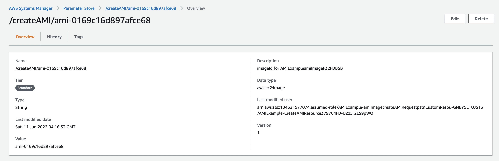

# cdk-create-ami


An AWS Cloud Development Kit (AWS CDK) construct library that allows you to build an [Amazon EC2](https://aws.amazon.com/ec2/) instance and create an [Amazon Machine Image](https://docs.aws.amazon.com/AWSEC2/latest/UserGuide/AMIs.html) from that instance.

## Background

From [Creating an AMI](https://docs.aws.amazon.com/AWSEC2/latest/UserGuide/AMIs.html#creating-an-ami):

> You can launch an instance from an existing AMI, customize the instance (for example, [install software](https://docs.aws.amazon.com/AWSEC2/latest/UserGuide/install-software.html) on the instance), and then save this updated configuration as a custom AMI. Instances launched from this new custom AMI include the customizations that you made when you created the AMI.

This CDK Construct will assist in you creating that AMI for later use.

## Installing

To add to your AWS CDK package.json file:

```
yarn add cdk-create-ami
```

## How It Works

To create an image:

```ts
import * as ami from 'cdk-create-ami';
```

```ts
const amiImage = new ami.CreateAMI(this, 'amiImage', {
  instanceId: baseInstance.instanceId,
  deleteAmi: true,
  deleteInstance: true,
  blockDeviceMappings: [
    {
      deviceName: '/dev/sdh',
      ebs: {
        volumeSize: 20,
        volumeType: ami.VolumeType.GP3,
        deleteOnTermination: true,
      },
    },
  ],
  tagSpecifications: [
    {
      resourceType: ami.ResourceType.IMAGE,
      tags: [{ key: 'TagKey', value: 'TagValue' }],
    },
  ],
});
```

This will take an already created [Instance](https://docs.aws.amazon.com/AWSEC2/latest/UserGuide/Instances.html) and convert it to an AMI. This process involves stopping the Instance and then creating the AMI. Besides typical AMI creation options regarding [block device mappings](https://docs.aws.amazon.com/AWSEC2/latest/UserGuide/block-device-mapping-concepts.html) and [tags](https://docs.aws.amazon.com/AWSEC2/latest/UserGuide/Using_Tags.html), the AMI can be created with two options:

```ts
      deleteAmi: true,
      deleteInstance: true,
```

- deleteAmi: When the CDK is destroyed, if this is set to `True`, the AMI will be deleted. Otherwise, the AMI will be retained.
- deleteInstance: When the CDK is deployed, if this is set to `True`, the base image will be deleted. Otherwise, the instance will be retained in a `Stopped` state.

## Example

The associated exmaple includes two Stacks that can be created.

- AMIExample - Deploys Instance and creates AMI from Instance
- InstanceExmaple - Deplotys Instance from previously created AMI

### AMI Example

```
cd example
yarn ami
```

This will deploy an Instance and create an AMI from the created Instance.

#### Creating the Instance

```ts
const vpc = new VPC(this, 'VPC');
const baseInstance = new BaseInstance(this, 'Instance', {
  vpc: vpc.vpc,
  securityGroup: vpc.securityGroup,
  ec2Role: vpc.ec2Role,
});
```

The exmaple will create a VPC and Instance to be used to create the AMI. This instance contains a [cloud-init script](example/resources/base_install.sh):

```bash
HOMEDIR=/home/ec2-user
yum update -y
yum install net-tools -y
yum install wget -y

TOKEN=`curl -X PUT "http://169.254.169.254/latest/api/token" -H "X-aws-ec2-metadata-token-ttl-seconds: 21600"`
LOCAL_HOSTNAME=$( curl -H "X-aws-ec2-metadata-token: $TOKEN" -v http://169.254.169.254/latest/meta-data/public-hostname )
INSTANCE_ID=$( curl -H "X-aws-ec2-metadata-token: $TOKEN" -v http://169.254.169.254/latest/meta-data/instance-id )

echo "AMI Hostname: $LOCAL_HOSTNAME" >> /home/ec2-user/config.txt
echo "AMI InstanceId: $INSTANCE_ID" >> /home/ec2-user/config.txt
```

This will result in a file: `/home/ec2-user/config.txt` that contains the base instance information. This fille will be retained in the AMI.

```
AMI Hostname: ec2-54-152-127-245.compute-1.amazonaws.com
AMI InstanceId: i-002aeb6cdde92c9b5
```

#### SSM

The AMI information will be stored in AWS Systems Manager - Parameter Store



### Instance Example

Once the AMI has been created, that AMI can be used to create a new Instance that has been pre-configured.

```bash
yarn instance imageId=IMAGEID
```

The IMAGEID to be used is provided as output from the AMI Example Stack.

This AMI Image ID is retrieved by the CDK:

```ts
const customAmi = new ec2.GenericSSMParameterImage(
  '/createAMI/' + props.imageId,
  ec2.OperatingSystemType.LINUX,
);
```

This AMI Image ID is used to create the new Instance:

```ts
const ec2Instance = new ec2.Instance(this, 'Instance', {
  vpc: props.vpc,
  instanceType: ec2.InstanceType.of(
    ec2.InstanceClass.T4G,
    ec2.InstanceSize.MEDIUM,
  ),
  machineImage: customAmi,
  // More Instance configuration here
});
```

This instance contains a [cloud-init script](example/resources/new_install.sh):

```bash
HOMEDIR=/home/ec2-user

TOKEN=`curl -X PUT "http://169.254.169.254/latest/api/token" -H "X-aws-ec2-metadata-token-ttl-seconds: 21600"`
LOCAL_HOSTNAME=$( curl -H "X-aws-ec2-metadata-token: $TOKEN" -v http://169.254.169.254/latest/meta-data/public-hostname )
INSTANCE_ID=$( curl -H "X-aws-ec2-metadata-token: $TOKEN" -v http://169.254.169.254/latest/meta-data/instance-id )

echo "New Instance Hostname: $LOCAL_HOSTNAME" >> /home/ec2-user/config.txt
echo "New Instance InstanceId: $INSTANCE_ID" >> /home/ec2-user/config.txt
```

Because the Instance used to create the AMI has already updated and installed packages, these do not need to be run again. Instead, the new Instance Hostname and InstanceId will be copied to the existing `/home/ec2-user/config.txt` file.

```text
AMI Hostname: ec2-54-152-127-245.compute-1.amazonaws.com
AMI InstanceId: i-002aeb6cdde92c9b5
New Instance Hostname: ec2-54-242-5-47.compute-1.amazonaws.com
New Instance InstanceId: i-0e67014a77d5d1995
```

## Contributing

See [CONTRIBUTING](CONTRIBUTING.md) for more information.

## License

This project is licensed under the Apache-2.0 License.
